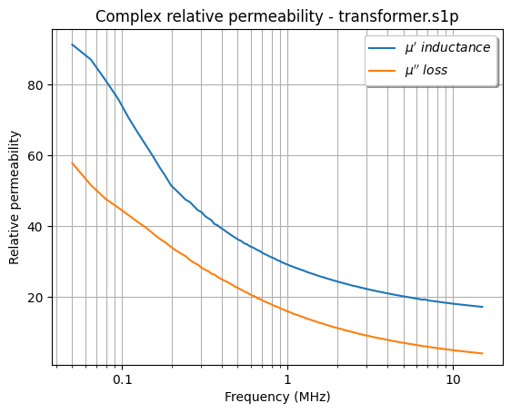
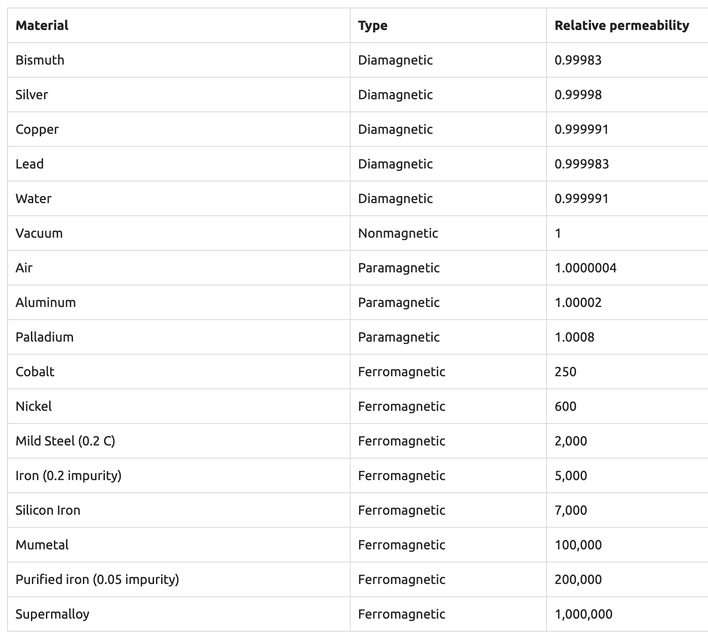
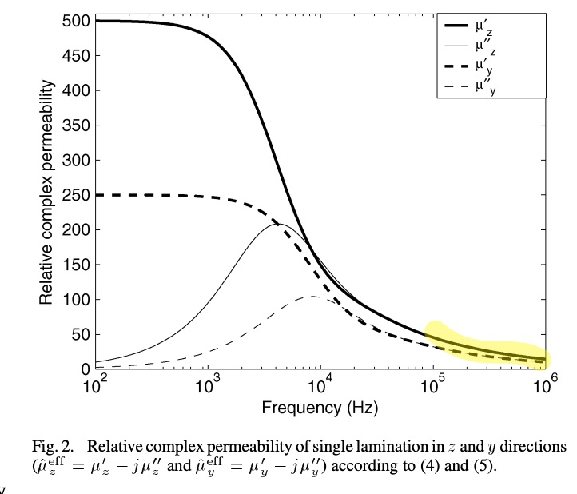
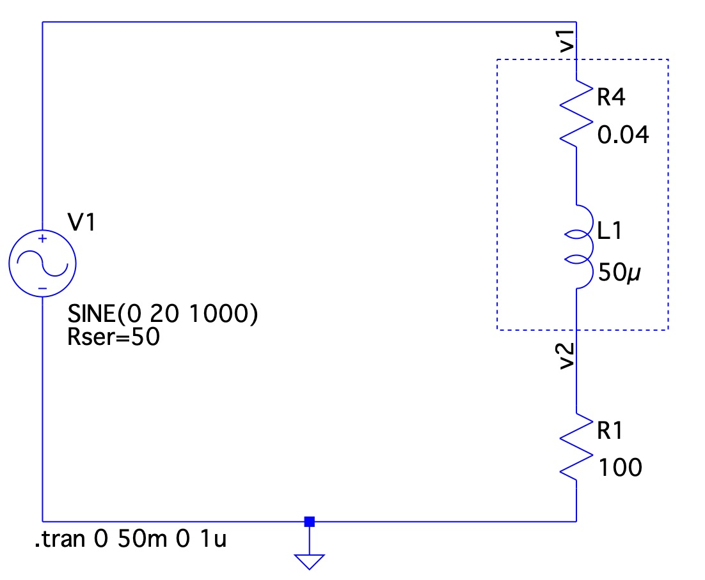
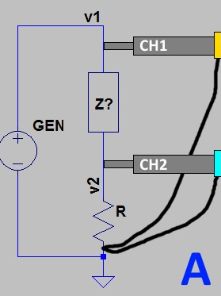
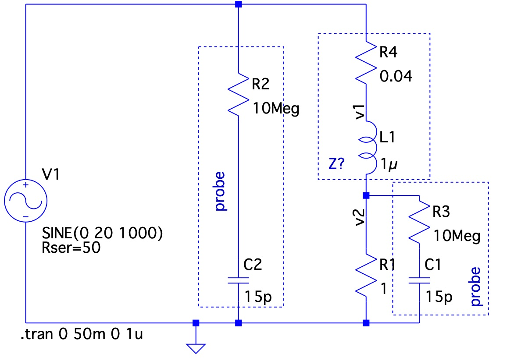
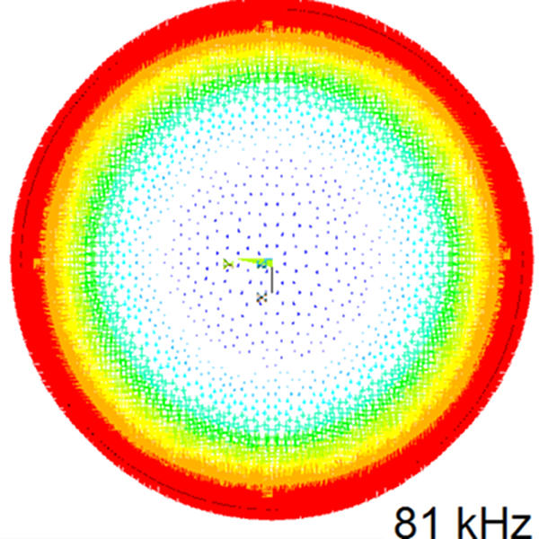
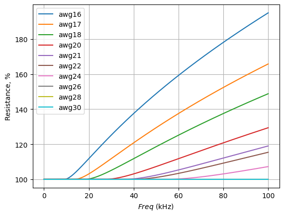
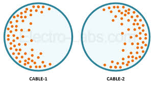

# DIY VNA for low frequencies
How to measure complex impedance at low (audio) frequencies.

# Motivation
I was studying magnetism in general and the magnetic permeabilities of materials in particular. See projects

* transformer-cores
* ferrite-cores
* ferrite-beads

At HF/UHF frequencies I can measure reasonably everything and it all makes sense. Then I came across line power inductors/transformers, I salvaged a few from an old fluorescent tube starter circuit. These suppose to operate at 60Hz.

NanoVNA's lowest frequency is 50kHz. These look to me as transformer steel aka silicon steel aka magnetically soft steel. I was not able to measure coil impedance and compute the relative permeability of these iron cores that would match online records.

VNA measurement (see the transformer-cores project) shows a steady drop of relative permeability from ~90 down. 

The literature I found on the internet has extensive coverage for ferrite, nanocrystalline, and amorphous core materials that operates at high frequencies. The datasheets start from 10kHz and other times from 100 kHz.Surprisingly, line power core materials like transformer iron silicon steel are not as popular. It's probably old tech and not a significant source of research/study.

There are tables like this being copied from one [source][2] to another

 

But it is rather pointless, as the table does not depict the dependencies on frequencies and temperature. 
There are (chemically) different kinds of steels and irons that have (physically) different crystal structures that affect their magnetic properties. This page is a [click-bait, paid-for, source of great info on magnetic metallurgy][4]. Even from free snippets, one can gain a great insight into the complexities there.

There is a relevant study [Complex Permeability for Various Magnetic Materials][3] (also see PDF)

Good introduction from there

> The magnetic materials are essential for the magnetic energy storage of various applications such as power converters and wireless power transfer systems. As low operating frequency applications (50 Hz/60 Hz), silicon steel sheet materials are widely used for the utility transformers or pole transformers in various industries. On the other hands, most electric devices are designed based on the high-frequency magnetic materials, operating at several tens of kHz high operating frequency, for compact size of the magnetic components. In general, high-frequency ferrite cores are highly preferred due to high-frequency characteristics, low core loss, and easy manufacturing. Recently, amorphous cores, which are formed by multi layers of laminated cores, are also the alternative solutions for 60 Hz–100 kHz of operating frequency applications. Such amorphous cores have a high saturated magnetic field Bsat (≈1.5 T) and can reduce the eddy loss due to ultra-thin-laminated Fe-based plates. In order to miniaturize the magnetic materials, Nanocrystalline alloy, which is usually composed of Fe, Si, B with the other chemical combinations, can be utilized over 1 kHz–100 kHz of operating frequency applications. Such magnetic materials mentioned above have their own merits and demerits for various applications.

I also found this study on the [Complex Permeability of Silicon Steel][1] (also see PDF) that shows the permeability they measured. 

Notice the tail of the plot, painted yellow. These are the frequencies I was able to measure on the plot above. This portion matches my measurements.

All-in-all, I wanted to measure complex impedance at low frequencies to characterize salvaged cores.

# The impedance at low frequencies

Turns out that measuring impedance is not easy. Measuring impedance with precision is hard, and knowing where errors are coming from is even harder.
Here is one simple circuit, that requires a signal generator and AC voltmeters or oscilloscope. 

 

 

Here the known resistance R1 is used to measure current, technically voltage, but assuming that R1 is purely resistive, it gives us the current waveform 
$$I = \frac V R$$ 
then the impedance Z is computed via the phase angle between voltage and current waveforms.

See [diy-vna.ipynb](diy-vna.ipynb)

Scope probes have finite resistance and stray capacitance. The measurement circuit model looks like this:

 

Another naive assumption is that the coil itself is purely inductive with some preset resistance across all frequencies. 

 

It is not the case. As frequency goes up, the copper wire becomes more and more resistant due to the skin effect. What is also counterintuitive, is that a thicker wire proportionally loses conductivity faster. A thin wire does not have enough "depth" to lose.

 

See [code here](skin-effect.ipynb)

Here is a quick reference table wire [AWG-to-Max frequency for 100% skin depth][6]. 

The somewhat good news is that for 100Hz..100kHz we can use thin wires AWG26+ and ignore this error.

Yet another source of errors is the wire proximity effect between the windings. Which I'm also going to ignore.

  

I am going to space wire loops apart and ignore this error.

---

For impedance measurement, we need an AC voltmeter. An oscilloscope is a relatively imprecise voltmeter. ADC is 8 bits as it is, then there is offset and actual % error. This is another source of error. Yet, the Rigol ds1054z is the only instrument I have.

Here is a [good source for circuits][5] for cheap DIY impedance measurement. 

Here is a [SPICE](diy-vna.asc) simulation. 

Notice, that measuring impedance at frequencies like 100Hz with a preset resistor R1 of 100 Ohm introduces another error. The phase angle is a fraction of a degree. 

Add here all the sources of errors mentioned above and the whole fixture looks bad from the metrology perspective. Better than nothing though...

[1]: <https://ieeexplore.ieee.org/document/4475319/> "Determination of Complex Permeability of Silicon Steel for Use in High-Frequency Modeling of Power Transformers"
[2]: https://www.microwaves101.com/encyclopedias/magnetic-materials
[3]: https://www.mdpi.com/2079-9292/10/17/2167
[4]: https://www.sciencedirect.com/topics/materials-science/silicon-steel
[5]: https://www.nutsvolts.com/magazine/article/a_low_cost_rf_impedance_analyzer
[6]: https://kaizerpowerelectronics.dk/theory/wire-size-table/